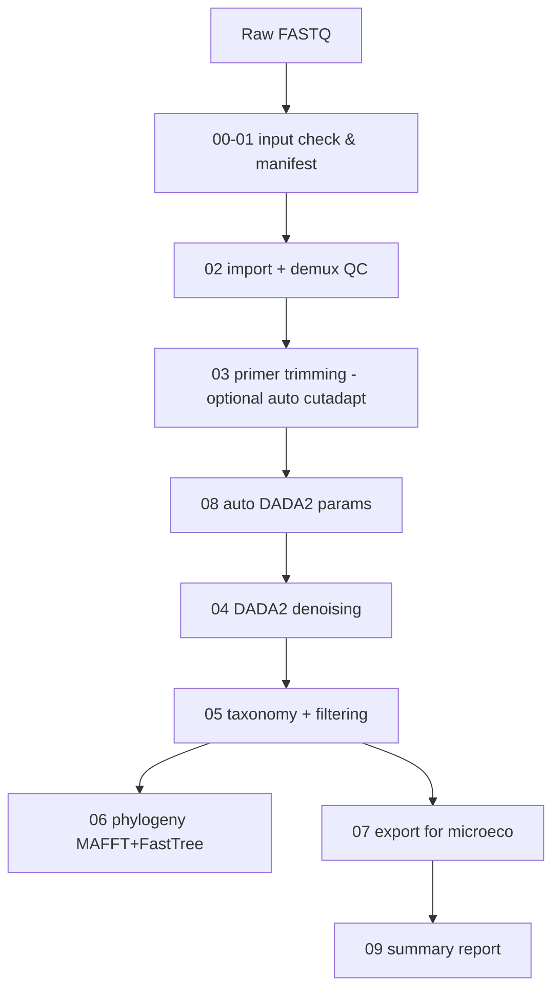
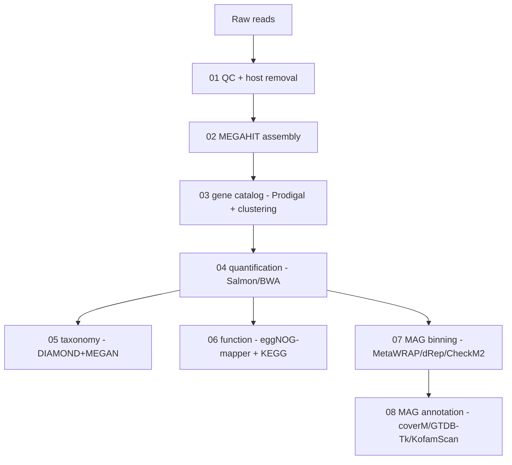

# Microbiome-SOP-Toolkit

**Reproducible, parameterized, Linux/HPC-friendly workflows for 16S rRNA
amplicon and shotgun metagenomic sequencing — packaged from real research
SOPs into Conda environments, a unified CLI, YAML configuration, and full
documentation.**

[](LICENSE)

```text
microbiome-toolkit 16s        → QIIME2-based 16S amplicon pipeline
microbiome-toolkit metagenome → shotgun metagenomics pipeline (8 modules)
```

---

## What does this tool do?

Two standardized, parameterized bioinformatics pipelines:

| | **16s workflow** | **metagenome workflow** |
|---|---|---|
| Input | paired/single-end FASTQ + (optional) metadata | paired-end reads (optionally + host genome) |
| Steps | import → quality QC → primer trim → DADA2 → taxonomy → phylogeny → microeco export | QC/dehost → MEGAHIT assembly → gene catalog → quantification → taxonomy → function → MAG binning → MAG annotation |
| Output | QIIME2 artifacts + file2meco-ready inputs | gene/abundance/taxonomy/function tables + MAGs + annotations |
| Key tools | QIIME2 2026.4 (q2-dada2, q2-feature-classifier, q2-phylogeny, ...), file2meco/microeco | kneaddata, MEGAHIT, Prodigal, MMseqs2/CD-HIT, Salmon/BWA, DIAMOND+MEGAN, eggNOG-mapper, MetaWRAP, dRep, CheckM2, GTDB-Tk, KofamScan, coverM |

Both workflows were packaged from **actual research SOPs** (see
`docs/original_SOP/`), preserving the original analysis logic while removing
server-specific hard-coded paths, adding parameters, logging, resume support,
and reproducible Conda environments.

### Highlights

- **Reproducible** — Conda environments in `envs/` (QIIME2 fully pinned to the
  official 2026.4 distribution), software versions recorded per run
  (`results/software_versions.tsv`).
- **Standardized** — identical parameter model for every step; YAML config
  files plus CLI flags.
- **Parameterized** — no hard-coded absolute paths; databases are configured
  once per project (never committed).
- **Linux / HPC friendly** — pure bash + conda; PBS submission via
  `qiime2-sop --submit` / `mg-sop --submit`; per-module conda environments.
- **Safe to rerun** — resume markers, per-step logs, `--force`, and clear
  errors instead of silent failures.

---

## Workflow overview

### 16S workflow



### Metagenome workflow



Detailed step-by-step documentation:

- [`docs/16S_SOP.md`](docs/16S_SOP.md) — every 16S step: purpose, software, inputs, outputs, parameters
- [`docs/Metagenome_SOP.md`](docs/Metagenome_SOP.md) — every metagenome module, same format
- [`docs/PARAMETERS.md`](docs/PARAMETERS.md) — complete parameter reference (CLI + YAML + defaults)
- [`docs/DATABASES.md`](docs/DATABASES.md) — all reference databases: purpose, versions, download, configuration
- [`docs/SOP_REVIEW.md`](docs/SOP_REVIEW.md) — audit findings and packaging decisions
- [`docs/original_SOP/`](docs/original_SOP/) — the original SOPs (sanitized), for provenance

---

## Installation

### 1. Clone

```bash
git clone https://github.com/chengzhongyi8/Microbiome-SOP-Toolkit.git
cd Microbiome-SOP-Toolkit
```

(Or copy the folder to your Linux server / HPC login node.)

### 2. Create the Conda environments

Requires a Linux x86_64 machine with [Miniconda/Anaconda](https://docs.conda.io/)
installed.  First find your `conda.sh` (you will pass it to the pipelines):

```bash
conda info --base                      # e.g. /opt/anaconda3
# CONDA_SH = <that path>/etc/profile.d/conda.sh
```

**16S workflow** (QIIME2 2026.4 official distribution + optional R env):

```bash
conda env create -n qiime2 --file envs/16s.yml
conda env create -f envs/microeco.yml
conda activate microeco
Rscript -e 'install.packages("remotes", repos="https://cloud.r-project.org")'
Rscript -e 'remotes::install_github("ChiLiubio/file2meco")'
Rscript -e 'remotes::install_github("ChiLiubio/microeco")'
```

**Metagenome workflow** (separate environments per module — see
[`envs/README.md`](envs/README.md) for why):

```bash
for f in envs/metagenome_qc.yml envs/metagenome_base.yml envs/metagenome_eggnog.yml \
         envs/metawrap.yml envs/das_tool.yml envs/drep.yml envs/checkm2.yml \
         envs/gtdbtk.yml envs/mag_annotation.yml; do
  conda env create -f "$f"
done
```

> The pipeline activates the right environment per module automatically.  If
> you name environments differently, pass `--qc-env`, `--assembly-env`, … or
> set `conda.*` keys in the YAML config.

### 3. Databases

Large reference databases are **not** included.  See
[`docs/DATABASES.md`](docs/DATABASES.md) for the full checklist (SILVA
classifier, NR + MEGAN map, eggNOG, CheckM2, GTDB, KofamScan, host genomes).

---

## Quick start

### 16S

```bash
microbiome-toolkit 16s \
    --input data/fastq \
    --region 16S_V4 \
    --classifier /db/silva-138-99-515-806-nb-classifier.qza \
    --metadata metadata.tsv \
    --output results_16s/ \
    --threads 16 \
    --conda-sh /opt/anaconda3/etc/profile.d/conda.sh
```

Or with a config file:

```bash
microbiome-toolkit init-config 16s
# edit 16s_config.yaml ...
microbiome-toolkit 16s --config 16s_config.yaml
```

### Metagenome

```bash
microbiome-toolkit metagenome \
    --input data/reads \
    --project-dir results_mg \
    --qc-needed yes \
    --host-genome /db/host_db/wheat/wheat \
    --assembly co-assembly \
    --binning metawrap \
    --threads 28 --jobs 8 \
    --conda-sh /opt/anaconda3/etc/profile.d/conda.sh
```

Or with a config file (recommended — many optional flags):

```bash
microbiome-toolkit init-config metagenome
# edit metagenome_config.yaml (databases, module switches, resources) ...
microbiome-toolkit metagenome --config metagenome_config.yaml
```

### Cluster (PBS) submission

```bash
qiime2-sop --input data/fastq --region 16S_V4 --classifier CLS.qza --submit
mg-sop --input data/reads --host-genome /db/host_db/wheat/wheat --submit
```

Add `--dry-run` to preview the command or PBS script without running anything.

### On a cluster

Use `--check-only` (metagenome) or `--init-only` (16S) to validate inputs and
parameters before launching long jobs.  All CLI flags documented in
[`docs/PARAMETERS.md`](docs/PARAMETERS.md).

---

## What inputs do I need?

**16S**: a directory of FASTQ files (`*_R1.fastq.gz` / `*_R2.fastq.gz`,
top level only), a region name or primer sequences, and a taxonomy classifier
(`.qza`).  Metadata is optional (auto-generated if absent).

**Metagenome**: a directory of paired-end reads (`*_1.fq.gz` / `*_2.fq.gz`,
many suffix conventions supported), and — for host removal — a host genome
FASTA or bowtie2 index.  Databases are required per enabled module (see
`docs/DATABASES.md`).

## What outputs will I obtain?

| Workflow | Key outputs |
|---|---|
| 16S | `results/qc/` (demux QC), `results/dada2/` (ASV table/rep-seqs/stats), `results/final/` (filtered table + taxonomy + rooted tree), `results/microeco_input/` (file2meco-ready), `results/summary/` |
| metagenome | `results/qc/` (read counts, MultiQC), `results/assembly/` (contigs + stats), `results/gene_catalog/` (genes + proteins), `results/quant/` (count/TPM/FPKM matrices), `results/taxonomy/` (per-rank tables), `results/function/` (KO/CAZy/COG + KEGG completeness), `results/mags/` (MAGs + quality + annotations), `results/summary/` |

Full output maps: [`docs/16S_SOP.md`](docs/16S_SOP.md#outputs-at-a-glance) and
[`docs/Metagenome_SOP.md`](docs/Metagenome_SOP.md).

---

## Repository structure

```text
Microbiome-SOP-Toolkit/
├── bin/                        # entry points (add to PATH or symlink)
│   ├── microbiome-toolkit      # unified dispatcher
│   ├── run_16s.sh              # 16S driver (pure CLI / --config)
│   ├── run_metagenome.sh       # metagenome driver (pure CLI / --config)
│   ├── qiime2-sop              # 16S wrapper (--submit/PBS, --dry-run)
│   ├── mg-sop                  # metagenome wrapper (--submit/PBS, --dry-run)
│   └── yaml2env.py             # YAML config -> env (stdlib only)
├── workflows/
│   ├── 16s/                    # steps 00-09, primers.tsv, activate scripts
│   └── metagenome/             # modules 01-08, workers, Python helpers
├── config/                     # 16s_config.example.yaml, metagenome_config.example.yaml
├── envs/                       # 11 reproducible Conda environments + README
├── docs/                       # SOP docs, PARAMETERS, DATABASES, SOP_REVIEW, original_SOP/
├── examples/                   # metadata template, samples/groups examples
├── tests/                      # static checks, unit tests, stub e2e
├── README.md
├── LICENSE                     # MIT
└── .gitignore                  # data/databases/logs never committed
```

## Testing

```bash
bash tests/run_static_checks.sh     # syntax, YAML, CLI, 16S smoke
bash tests/run_small_tests.sh       # Python-helper numerics
bash tests/run_e2e_stub.sh          # full metagenome dry run with stubs
```

See [`tests/README.md`](tests/README.md).  Real end-to-end runs with actual
tools require the Conda environments and databases listed above.

## Notes & limitations

- **16S**: automatic DADA2 trim/trunc estimates are *suggestions* — inspect
  `results/qc/demux.qzv` for degraded libraries and override with manual
  values.  The classifier must match your amplification region.
- **Metagenome**: `blast2lca` (MEGAN) is a standalone Java tool, not in
  conda; set `BLAST2LCA`.  `--eggnog-shm yes` copies the eggNOG database into
  `/dev/shm` — check space first.  Binning is resource-heavy: keep
  `threads × jobs` within your node's cores.
- The toolkit was validated on macOS (development) and is designed for Linux
  x86_64/HPC (bash ≥ 4, conda).  `tests/` require no bioinformatics install.

## License

MIT — see [LICENSE](LICENSE).
